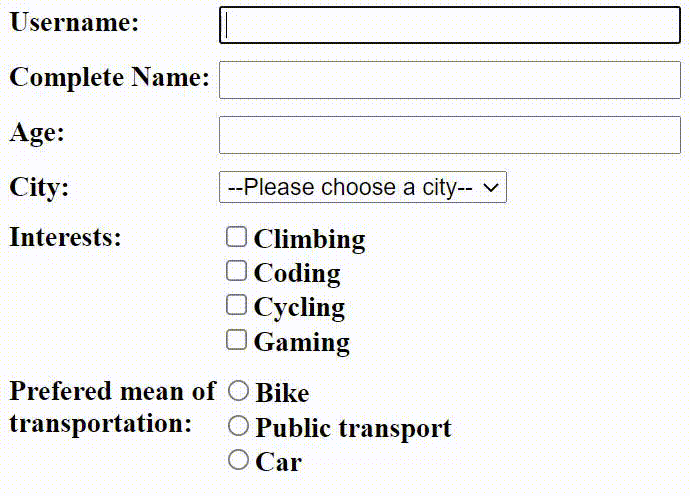

# cypress-forms-commands

**cypress-forms-commands** is a set of commands destined to simplify form filling and validation, by making it really easy to write and read tests that fill or validate forms.

It provides two main functions:

* **Form filling**
* **Form validation**

## Getting started

Install the package

`npm install cypress-forms-commands --save-dev`

Import the package in your cypress project in the file described by the `supportFile` parameter in your cypress configuration (`cypress.json` file).

`import 'cypress-forms-commands';`

If using typescript, include the types in your `tsconfig.json` file:

```json
{
    //...
    "compilerOptions": {
        // ...
        "types": [
          //...
          "cypress",
          "cypress-forms-commands"
        ]
    }
}

```

You're good to go!

## Form Filling

You can fill a form using the `fillForm` command.

#### fillForm

`fillForm` is the simpler version. It takes the object being passed to it, and tries to match the object keys with elements that have a matching attribute.

By default, this attribute is `cy-f`, but this attribute can be changed through the `cypress.json` file like so:

```json
// cypress.json
{
  "env": {
    "formscommands_handle_attribute": "my-new-attribute"
  }
}
```

The command will detect automatically the input type of the field so it can appropriately fill the information being passed to it.

Note that for select, checkboxes and radio buttons, the name of the option **value attribute** must also **match the value** passed for each key.

**Here is a complete example of a simple form being filled with the `fillForm` command:**

```html
<!-- index.html -->
<form>
  <label>Username:</label><input type="text" cy-f="username">
  <label>Complete Name:</label><input type="text" cy-f="completeName">
  <label>Age:</label><input type="number" cy-f="age">
  <label>
    City:
  </label>
  <select cy-f="city">
    <option value="">--Please choose a city--</option>
    <option value="calgary">Calgary</option>
    <option value="montreal">Montreal</option>
    <option value="toronto">Toronto</option>
  </select>
  <label>Interests:</label>
  <div>
    <label><input type="checkbox" cy-f="interest" name="interests" value="climbing">Climbing</label>
    <label><input type="checkbox" cy-f="interest" name="interests" value="coding">Coding</label>
    <label><input type="checkbox" cy-f="interest" name="interests" value="cycling">Cycling</label>
    <label><input type="checkbox" cy-f="interest" name="interests" value="gaming">Gaming</label>
  </div>
  <label>Prefered mean of transportation:</label>
  <div>
    <label><input type="radio" cy-f="transport" name="transport" value="bike">Bike</label><label><input type="radio" cy-f="transport" name="transport" value="public-transport">Public transport</label>
    <label><input type="radio" cy-f="transport" name="transport" value="car">Car</label>
  </div>
</form>
```

```js
// spec.ts

// the actual code needed to fill the form described in the html above
cy.fillForm({
  username: 'TestsSlayer',
  completeName: 'John Simpleman',
  age: 34,
  city: 'montreal',
  interests: [
    'coding',
    'climbing',
  ],
  transport: 'public-transport',
})
```

**Result in cypress:**



## Form Validation

The library also provides a simple way to validate a form content.

##### validateForm

The `validateForm` command takes the exact same parameter as the `fillForm` command. The only difference is that instead of filling the form, it validates that all the fields have the values in the object passed to the command.

**Here is a complete example of how to use the command to validate a form with `validateForm`:**

```js
// spec.ts
cy.validateForm({
  username: 'TestsSlayer', // text field
  completeName: 'John Simpleman', // text field
  age: 34, // number field
  city: 'montreal', // select
  interests: [
    'coding', // checkbox
    'climbing', // checkbox
  ],
  transport: 'public-transport', // radio button
})
```

## Field Mappers

In the previous examples, we saw some pretty simple cases with really simple html elements, but things are not always that simple. You might be using a framework that do not use real `select` tags or `checkboxes` for example.

In those cases, **you'll have to use field mappers as the second parameter** of the `fillForm` and `validateForm` commands.

A field mapper tells the command how to deal with a specific field in the form, by specifying the type of field, and the necessary selector to deal with the field.

Here's the structure of a mapper:

| Key             | Required for types            | Description                                                                 |
| --------------- | ----------------------------- | --------------------------------------------------------------------------- |
| type            | **ALL**                       | The type of selector to map. Can be `text`, `select`, `checkbox` or `radio` |
| selector        | `text`, `select`              | The main selector of the input. Only applies to `text` and `select`.        |
| choiceSelectors | `select`, `checkbox`, `radio` | The selector for each choice.                                               |

Let's see how you can map different field types:

#### Text input

```js
{
  type: 'text',
  selector: '#username-input'
}
```

#### Select

```js
{
  type: 'select',
  selector: '#city-select' // the element that has to be clicked to expand the select
  choiceSelectors: {
    calgary: '#calgary-select-option'
    montreal: '#montreal-select-option',
    toronto: '#toronto-select-option',
  }
}
```

#### Checkboxes

```js
{
  type: 'checkbox',
  choiceSelectors: {
    climbing: '#climbing-checkbox'
    coding: '#coding-checkbox',
    cycling: '#cycling-checkbox',
    gaming: '#gaming-checkbox',
  }
}
```

#### Radio

```js
{
  type: 'radio',
  choiceSelectors: {
    bike: '#bike-radio'
    publicTransport: '#public-transport-radio',
    car: '#car-radio',
  }
}
```

**Here is an example where we use the mappers to map the `checkboxes` and the `select` from the first example**

```js
// spec.ts
cy.fillForm({
  username: 'TestsSlayer',
  completeName: 'John Simpleman',
  age: 34,
  city: 'montreal',
  interests: [
    'coding',
    'climbing',
  ],
  transport: 'public-transport',
}, {
  city: { // the key matches 'city' from the values to fill
    type: 'select',
    selector: '#city-select'
    choiceSelectors: {
      calgary: '#calgary-select-option'
      montreal: '#montreal-select-option',
      toronto: '#toronto-select-option',
    }
  }
  interests: { // the key matches 'interests' from the values to fill
    type: 'checkbox',
    choiceSelectors: {
      climbing: '#climbing-checkbox'
      coding: '#coding-checkbox',
      cycling: '#cycling-checkbox',
      gaming: '#gaming-checkbox',
    }
  },
})
```

**Note that the keys in the mappers must match those from the values to fill (eg. '`interests`' === '`interests`')**